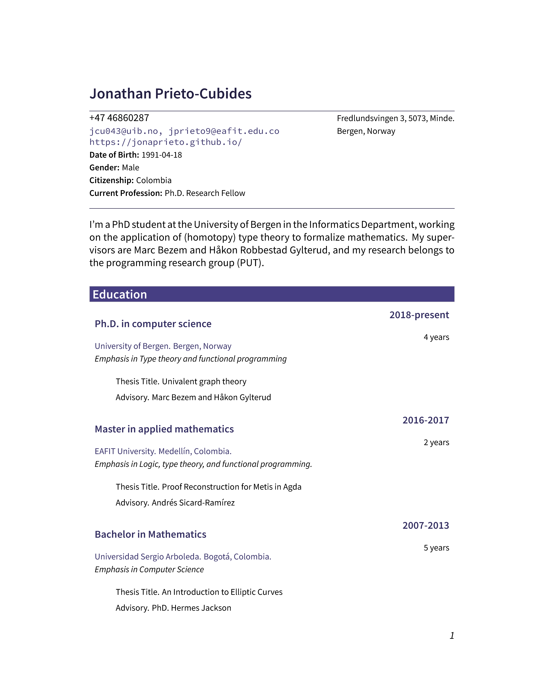

# My Curriculum Vitae

My résumé using [LaTeX](https://www.latex-project.org) and [Pandoc](http://pandoc.org):

  

## Getting Started

### Prerequisites

* Pandoc
* Latex


### Compiling

You fork or clone this repository:

```Bash
   $ git clone https://github.com/jonaprieto/curriculum-vitae
```

Generate the document in the folder `docs` running this command:

```
$ make
```

The idea here is keeping all your data in the `data.yml` file, don't bother
about latex. Open an issue or send a PR if you find somehow to improve this
repo.

### Small Example

Put the content of your CV in the `data.yml` file, like in the following:

```YAML
---
name: Friedrich Nietzsche
intro: Some introduction to resume here
email: friedrich@nietzsche.de
website:
  primary: jonaprieto.github.io
  secondary: another.github.com

phone:
    primary: +49 (0) 3643-545-630
    secondary: +49 (0) 3643-545-639
address:
    line1: Humboldtstr. 36
    line2: 99425 Weimar

experience:
    - years: 1879--1889
      job: Freier Philisoph
      employer: Freiberufler
      city: Sils-Maria
      task:
        - name: Lecturer of Physcology.
          years: 1880
    - years: 1869--1879
      job: Professor für klassische Philologie
      employer: Universität Basel
      city: Basel
      tasks:
          - Teach classic philology.
# Education
education:
    - years: 2016-present
      subject: Master in Applied Mathematics
      institute: EAFIT University
      city: Medellín
      tesis-title: Proof Reconstruction in \texttt{Agda} (Working on)
      tesis-advisor: Phd. Andrés Sicard-Ramiréz

# Skills
skills:
  - Speak Louder
  - Coding in the morning with a coffe.

# Technical Skills
tech:
  - lang: python
  - year: 2016-2020
  - domain: 30\%
  - proyects:
    - name: An amazing project
    - year: 2017
    - url: http://www.github.com/jonaprieto/
    - description: something to say
```

## License

This project is licensed under the terms of the [MIT license](https://opensource.org/licenses/MIT).
